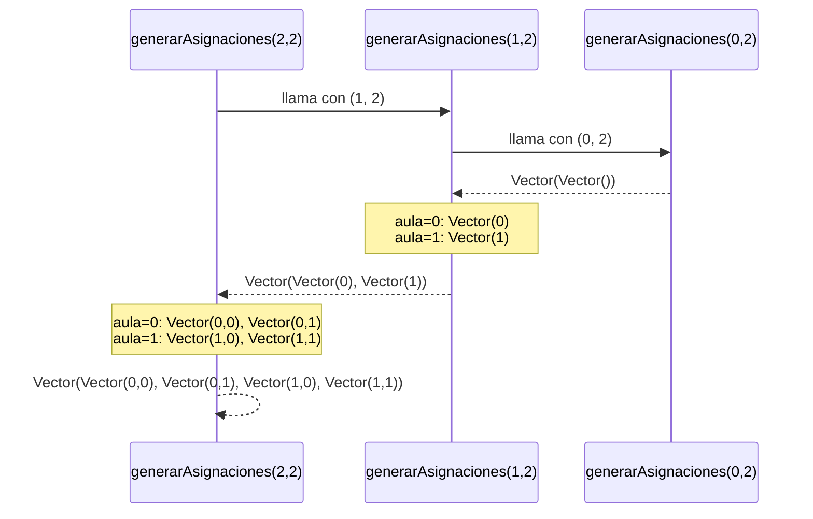
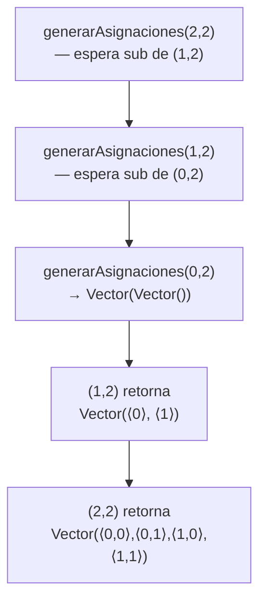
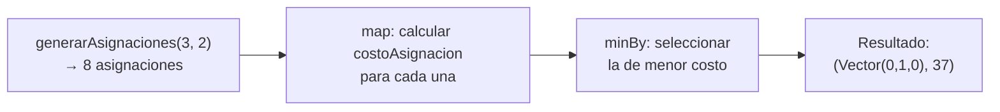
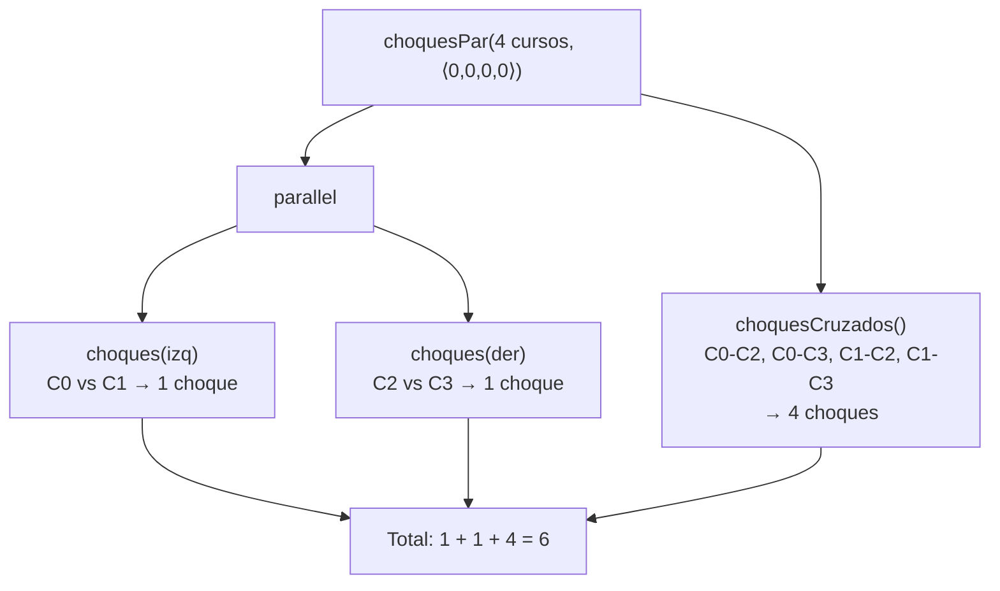

# Informe de Proceso
 
---
 
## `generarAsignaciones`
 
### Descripción
 
`generarAsignaciones(n, m)` genera todas las asignaciones completas posibles: vectores de longitud `n` donde cada posición toma un valor en `{0, 1, ..., m-1}`. El total de asignaciones es $m^n$.
 
### Enfoque funcional
 
Se usa **recursión lineal** combinada con `flatMap` y `map` (funciones de alto orden):
 
- **Caso base:** si `n == 0`, no hay cursos que asignar → se retorna un vector con la asignación vacía: `Vector(Vector.empty)`.
- **Caso recursivo:** se generan las sub-asignaciones para `n-1` cursos y, para cada posible aula `j ∈ {0,...,m-1}`, se antepone `j` a cada sub-asignación.
```scala
def generarAsignaciones(n: Int, m: Int): Vector[Asignacion] = {
  if (n == 0) Vector(Vector.empty)
  else {
    val subAsignaciones = generarAsignaciones(n - 1, m)
    (0 until m).toVector.flatMap { aula =>
      subAsignaciones.map { sub => aula +: sub }
    }
  }
}
```
 
### Ejemplo: `generarAsignaciones(2, 2)`
 
#### Pila de llamados
 

 
#### Despliegue de la pila paso a paso
 

 
| Paso | Llamado activo | Lo que retorna |
|------|----------------|----------------|
| 1 | `generarAsignaciones(2, 2)` | pendiente |
| 2 | `generarAsignaciones(1, 2)` | pendiente |
| 3 | `generarAsignaciones(0, 2)` | `Vector(Vector())` |
| 4 | `generarAsignaciones(1, 2)` se resuelve | `Vector(Vector(0), Vector(1))` |
| 5 | `generarAsignaciones(2, 2)` se resuelve | `Vector(Vector(0,0), Vector(0,1), Vector(1,0), Vector(1,1))` |
 
---
 
## `asignacionOptima`
 
### Descripción
 
`asignacionOptima` encuentra la asignación con el menor costo total usando las funciones de sus compañeros (`costoAsignacion`) y la función propia `generarAsignaciones`.
 
### Enfoque funcional
 
No requiere recursión propia. Usa funciones de alto orden:
 
- `map` para evaluar el costo de cada asignación candidata.
- `minBy` para seleccionar la de menor costo.
```scala
def asignacionOptima(cursos: Cursos, aulas: Aulas, d: Distancias,
                     w: Pesos): (Asignacion, Int) = {
  val todasLasAsignaciones = generarAsignaciones(cursos.length, aulas.length)
  todasLasAsignaciones
    .map { a => (a, costoAsignacion(cursos, aulas, d, a, w)) }
    .minBy { case (_, costo) => costo }
}
```
 
### Ejemplo: Ejemplo 1 del enunciado
 
**Entrada:** `cursosEj1`, `aulasEj1`, `distEj1`, `w = (1000, 100, 1, 2)`
 
**Proceso:**
 

 
| Asignación | CH | CF | DE | MV | CT |
|---|---|---|---|---|---|
| `⟨0,0,0⟩` | 1 | 0 | 45 | 3 | 1048 |
| `⟨0,0,1⟩` | 1 | 0 | 25 | 3 | 1031 |
| `⟨0,1,0⟩` | 0 | 0 | 25 | 6 | **37** ✓ |
| `⟨0,1,1⟩` | 0 | 0 | 45 | 6 | 57 |
| ... | ... | ... | ... | ... | ... |
 
La asignación óptima es $\alpha^* = \langle 0, 1, 0 \rangle$ con costo total **37**.
 
---
 
## `choquesPar`
 
### Descripción
 
`choquesPar` paralela la versión secuencial `choques` dividiendo el vector de cursos en dos mitades y ejecutando los conteos de forma concurrente con `parallel`.
 
### Enfoque funcional y concurrente
 
```scala
def choquesPar(cursos: Cursos, a: Asignacion): Int = {
  val n = cursos.length
  val mid = n / 2
  val cursosIzq = cursos.take(mid)
  val asigIzq   = a.take(mid)
  val cursosDer = cursos.drop(mid)
  val asigDer   = a.drop(mid)
 
  def choquesCruzados(): Int = {
    (for {
      i <- cursosIzq.indices
      j <- cursosDer.indices
      if asigIzq(i) == asigDer(j) && asigIzq(i) >= 0
      if solapan(cursosIzq(i), cursosDer(j))
    } yield 1).sum
  }
 
  val (choquesIzq, choquesDer) = parallel(
    choques(cursosIzq, asigIzq),
    choques(cursosDer, asigDer)
  )
 
  choquesIzq + choquesDer + choquesCruzados()
}
```
 
### Ejemplo: 4 cursos, asignación `⟨0, 0, 0, 0⟩`
 
```
Cursos: C0=[0,10), C1=[2,12), C2=[4,14), C3=[6,16)
Mitad izq: C0, C1  |  Mitad der: C2, C3
```
 

 
| Par | Misma aula | Se solapan | Choque |
|-----|-----------|------------|--------|
| C0-C1 (izq-izq) | ✓ | ✓ | 1 |
| C2-C3 (der-der) | ✓ | ✓ | 1 |
| C0-C2 (cruzado) | ✓ | ✓ | 1 |
| C0-C3 (cruzado) | ✓ | ✓ | 1 |
| C1-C2 (cruzado) | ✓ | ✓ | 1 |
| C1-C3 (cruzado) | ✓ | ✓ | 1 |
| **Total** | | | **6** |
 
Esto coincide con $\binom{4}{2} = 6$ pares, todos solapados en la misma aula.
