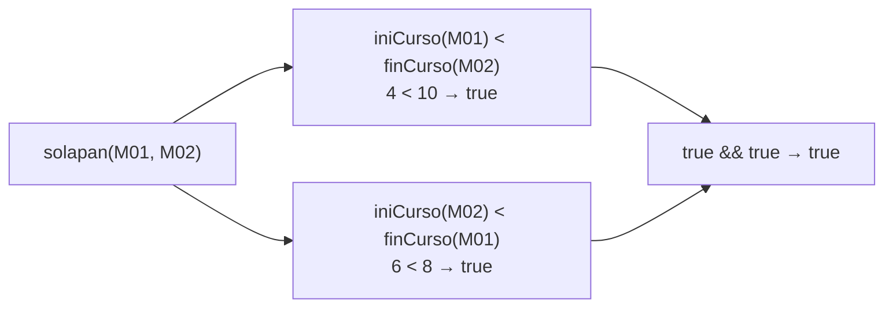
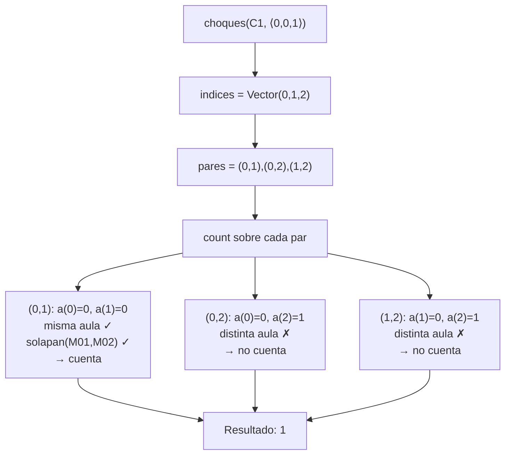
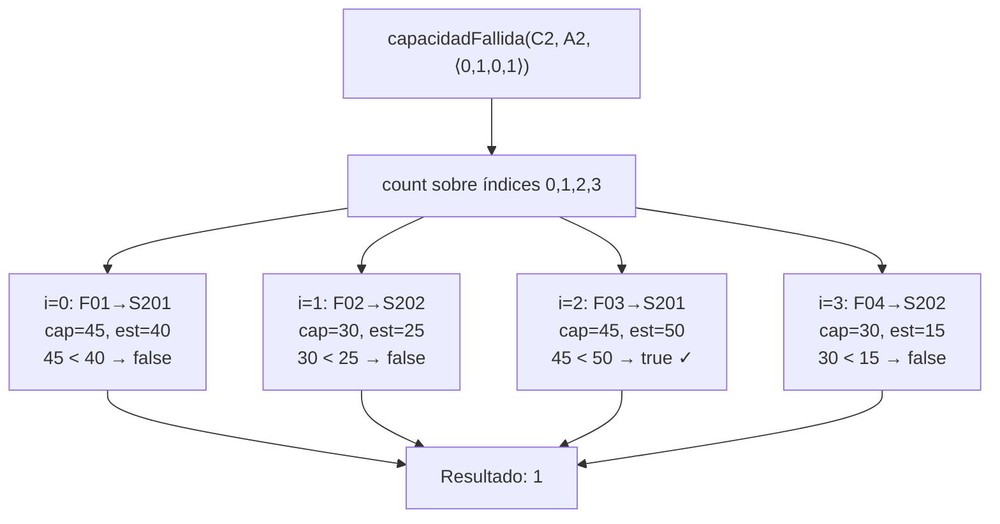
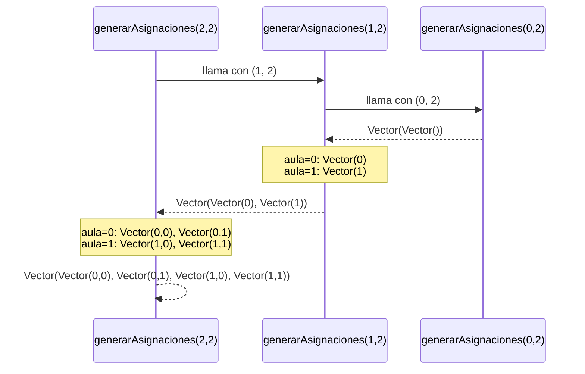
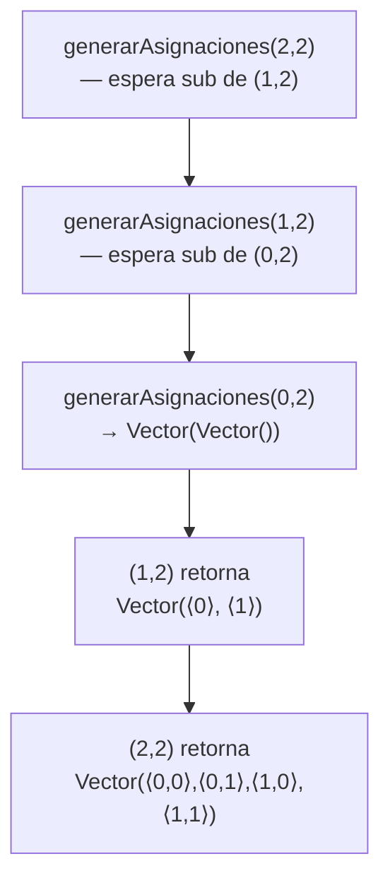
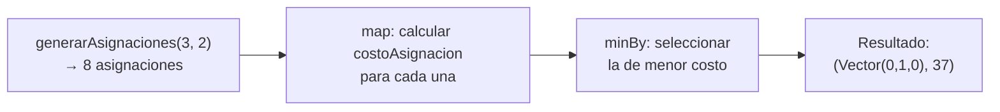
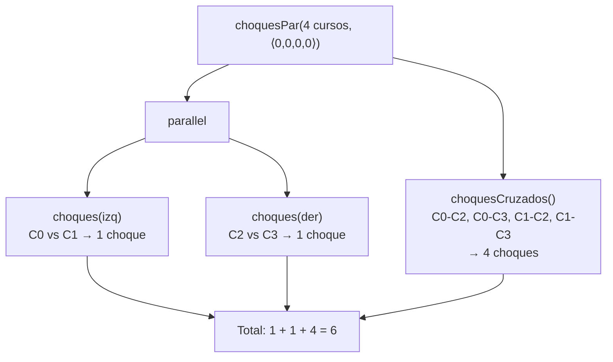

# Informe de Proceso
---
## `solapan`

### Descripción

`solapan(c1, c2)` determina si dos cursos se traslapan en el tiempo. Dos cursos se solapan si y solo si sus intervalos $[\text{ini}_1, \text{fin}_1)$ y $[\text{ini}_2, \text{fin}_2)$ tienen intersección no vacía.

### Enfoque funcional

La función es **no recursiva**: se implementa directamente con una expresión booleana que aplica la condición estándar de solapamiento de intervalos semi-abiertos.

```scala
def solapan(c1: Curso, c2: Curso): Boolean =
  iniCurso(c1) < finCurso(c2) && iniCurso(c2) < finCurso(c1)
```

La condición equivale a negar la disjunción: dos intervalos **no** se solapan si uno termina antes de que el otro empiece, es decir $\text{fin}_1 \leq \text{ini}_2$ o $\text{fin}_2 \leq \text{ini}_1$. Por negación:

$$\text{solapan}(c_1, c_2) \iff \text{ini}_1 < \text{fin}_2 \;\wedge\; \text{ini}_2 < \text{fin}_1$$

### Ejemplo: M01 y M02 del enunciado

**Entrada:**

$$c_1 = \langle\text{M01}, 4, 8, 25\rangle, \quad c_2 = \langle\text{M02}, 6, 10, 30\rangle$$

**Evaluación paso a paso:**



| Subexpresión | Valor |
|---|---|
| `iniCurso(c1)` | 4 |
| `finCurso(c2)` | 10 |
| `4 < 10` | `true` |
| `iniCurso(c2)` | 6 |
| `finCurso(c1)` | 8 |
| `6 < 8` | `true` |
| **Resultado** | **`true`** |

### Ejemplo: M01 y M03 (no solapan)

$$c_1 = \langle\text{M01}, 4, 8, 25\rangle, \quad c_3 = \langle\text{M03}, 12, 16, 20\rangle$$

| Subexpresión | Valor |
|---|---|
| `4 < 16` | `true` |
| `12 < 8` | **`false`** |
| **Resultado** | **`false`** |

La segunda condición falla porque M03 comienza después de que M01 termina.

### Complejidad

La función evalúa exactamente dos comparaciones de enteros y una conjunción lógica:

$$T = O(1)$$

---

## `choques`

### Descripción

`choques(cursos, a)` cuenta el número de pares $(i, j)$ con $i < j$ tales que $\alpha_i = \alpha_j \geq 0$ y los cursos $c_i$ y $c_j$ se solapan en el tiempo. Formalmente:

$$\text{CH}_C^\alpha = \bigl|\{(i,j) \mid 0 \leq i < j < n,\; \alpha_i = \alpha_j,\; \alpha_i \geq 0,\; \text{solapan}(c_i, c_j)\}\bigr|$$

### Enfoque funcional

Se usa una **comprensión de listas funcional** (`for` generador, no ciclo) para producir todos los pares $(i, j)$ con $i < j$, seguida de `count` para contar cuántos satisfacen las tres condiciones: misma aula, aula válida y solapamiento.

```scala
def choques(cursos: Cursos, a: Asignacion): Int = {
  val indices = cursos.indices.toVector
  val pares = for {
    i <- indices
    j <- indices
    if i < j
  } yield (i, j)

  pares.count { case (i, j) =>
    a(i) >= 0 && a(j) >= 0 &&
    a(i) == a(j) &&
    solapan(cursos(i), cursos(j))
  }
}
```

### Ejemplo: Ejemplo 1 del enunciado, $\alpha_1 = \langle 0, 0, 1\rangle$

**Entrada:**

$$C_1 = \langle\langle\text{M01},4,8,25\rangle,\langle\text{M02},6,10,30\rangle,\langle\text{M03},12,16,20\rangle\rangle, \quad \alpha = \langle 0, 0, 1\rangle$$

**Pares generados y evaluación:**



| Par $(i,j)$ | $\alpha_i$ | $\alpha_j$ | Misma aula | Solapan | Cuenta |
|---|---|---|---|---|---|
| $(0,1)$ | 0 | 0 | ✓ | ✓ | **1** |
| $(0,2)$ | 0 | 1 | ✗ | — | 0 |
| $(1,2)$ | 0 | 1 | ✗ | — | 0 |
| **Total** | | | | | **1** |


### Complejidad

La función genera todos los pares $(i, j)$ con $i < j$, de los cuales hay $\binom{n}{2}$ en total, y evalúa las condiciones en tiempo constante para cada par:

$$T(n) = O(n^2)$$

---

## `capacidadFallida`

### Descripción

`capacidadFallida(cursos, aulas, a)` cuenta cuántos cursos están asignados a un aula cuya capacidad es **estrictamente menor** al número de estudiantes del curso:

$$\text{CF}_C^\alpha = \bigl|\{i \mid \alpha_i \geq 0,\; \text{cap}(a_{\alpha_i}) < \text{est}(c_i)\}\bigr|$$

### Enfoque funcional

Se usa `count` sobre los índices del vector de cursos, aplicando la condición directamente sobre cada posición:

```scala
def capacidadFallida(cursos: Cursos, aulas: Aulas, a: Asignacion): Int =
  cursos.indices.toVector.count { i =>
    val j = a(i)
    j >= 0 && capAula(aulas(j)) < estCurso(cursos(i))
  }
```

La función no es recursiva: delega toda la iteración a `count`, que aplica el predicado a cada índice y acumula el total de resultados `true`.

### Ejemplo: Ejemplo 2 del enunciado, $\alpha_1 = \langle 0, 1, 0, 1\rangle$

**Entrada:**

$$C_2 = \langle\langle\text{F01},0,4,40\rangle,\langle\text{F02},4,8,25\rangle,\langle\text{F03},8,12,50\rangle,\langle\text{F04},12,16,15\rangle\rangle$$

$$A_2 = \langle\langle\text{S201},45\rangle,\langle\text{S202},30\rangle\rangle, \quad \alpha = \langle 0,1,0,1\rangle$$

**Evaluación por índice:**



| $i$ | Curso | Aula asignada | cap | est | cap $<$ est | Falla |
|---|---|---|---|---|---|---|
| 0 | F01 | S201 | 45 | 40 | `false` | No |
| 1 | F02 | S202 | 30 | 25 | `false` | No |
| 2 | F03 | S201 | 45 | 50 | **`true`** | **Sí** |
| 3 | F04 | S202 | 30 | 15 | `false` | No |
| **Total** | | | | | | **1** |


> **Nota:** Cuando `cap == est`, la condición `cap < est` es `false`, por lo que no se cuenta como fallo. La capacidad exacta es suficiente.

### Complejidad

La función recorre los $n$ cursos una sola vez, aplicando un predicado en tiempo constante a cada uno:

$$T(n) = O(n)$$

---

## `generarAsignaciones`

### Descripción

`generarAsignaciones(n, m)` genera todas las asignaciones completas posibles: vectores de longitud `n` donde cada posición toma un valor en $\{0, 1, \ldots, m-1\}$. El total de asignaciones es $m^n$.

### Enfoque funcional

Se usa **recursión lineal** combinada con `flatMap` y `map` (funciones de alto orden):

- **Caso base:** si `n == 0`, no hay cursos que asignar → se retorna un vector con la asignación vacía: `Vector(Vector.empty)`.
- **Caso recursivo:** se generan las sub-asignaciones para `n-1` cursos y, para cada posible aula $j \in \{0, \ldots, m-1\}$, se antepone $j$ a cada sub-asignación.

```scala
def generarAsignaciones(n: Int, m: Int): Vector[Asignacion] = {
  if (n == 0) Vector(Vector.empty)
  else {
    val subAsignaciones = generarAsignaciones(n - 1, m)
    (0 until m).toVector.flatMap { aula =>
      subAsignaciones.map { sub => aula +: sub }
    }
  }
}
```

### Ejemplo: `generarAsignaciones(2, 2)`

#### Pila de llamados



#### Despliegue de la pila paso a paso



| Paso | Llamado activo | Lo que retorna |
|------|----------------|----------------|
| 1 | `generarAsignaciones(2, 2)` | pendiente |
| 2 | `generarAsignaciones(1, 2)` | pendiente |
| 3 | `generarAsignaciones(0, 2)` | `Vector(Vector())` |
| 4 | `generarAsignaciones(1, 2)` se resuelve | `Vector(Vector(0), Vector(1))` |
| 5 | `generarAsignaciones(2, 2)` se resuelve | `Vector(Vector(0,0), Vector(0,1), Vector(1,0), Vector(1,1))` |

### Complejidad

Para cada uno de los $n$ cursos se generan $m$ posibilidades de asignación.

El número total de asignaciones generadas es:

$$m^n$$

Por lo tanto, el tiempo de ejecución es:

$$T(n) = O(m^n)$$

y el espacio requerido también es $O(m^n)$, porque todas las asignaciones se almacenan en memoria.

---

## `asignacionOptima`

### Descripción

`asignacionOptima` encuentra la asignación con el menor costo total usando `generarAsignaciones` para explorar el espacio completo de asignaciones, y `costoAsignacion` para evaluarlas.

### Enfoque funcional

No requiere recursión propia. Usa funciones de alto orden:

- `map` para evaluar el costo de cada asignación candidata.
- `minBy` para seleccionar la de menor costo.

```scala
def asignacionOptima(cursos: Cursos, aulas: Aulas, d: Distancias,
                     w: Pesos): (Asignacion, Int) = {
  val todasLasAsignaciones = generarAsignaciones(cursos.length, aulas.length)
  todasLasAsignaciones
    .map { a => (a, costoAsignacion(cursos, aulas, d, a, w)) }
    .minBy { case (_, costo) => costo }
}
```

### Ejemplo: Ejemplo 1 del enunciado

**Entrada:**

$$C_1 = \langle\langle\text{M01}, 4, 8, 25\rangle,\langle\text{M02}, 6, 10, 30\rangle,\langle\text{M03}, 12, 16, 20\rangle\rangle$$

$$A_1 = \langle\langle\text{E101}, 30\rangle,\langle\text{E102}, 40\rangle\rangle, \quad w = (1000, 100, 1, 2)$$

**Proceso:**



| Asignación | CH | CF | DE | MV | CT |
|---|---|---|---|---|---|
| $\langle 0,0,0\rangle$ | 1 | 0 | 45 | 3 | 1048 |
| $\langle 0,0,1\rangle$ | 1 | 0 | 25 | 3 | 1031 |
| $\langle 0,1,0\rangle$ | 0 | 0 | 25 | 6 | **37** ✓ |
| $\langle 0,1,1\rangle$ | 0 | 0 | 45 | 6 | 57 |
| $\langle 1,0,0\rangle$ | 0 | 0 | 45 | 6 | 57 |
| $\langle 1,0,1\rangle$ | 0 | 0 | 25 | 6 | 37 |
| $\langle 1,1,0\rangle$ | 1 | 0 | 25 | 3 | 1031 |
| $\langle 1,1,1\rangle$ | 1 | 0 | 45 | 3 | 1048 |

La asignación óptima es $\alpha^* = \langle 0, 1, 0 \rangle$ con costo total **37**.

> **Nota:** Puede existir más de una asignación óptima con el mismo costo mínimo (por ejemplo $\langle 1,0,1\rangle$ también tiene CT = 37). La función retorna la primera encontrada según el orden de exploración de `generarAsignaciones`.

### Complejidad

La función evalúa todas las asignaciones posibles generadas por `generarAsignaciones`. Si existen $m^n$ asignaciones posibles y el cálculo del costo para una asignación toma tiempo lineal respecto al número de cursos, entonces:

$$T(n) = O(m^n \cdot n)$$

La complejidad está dominada por la generación y evaluación de todas las asignaciones posibles.

---

## `choquesPar`

### Descripción

`choquesPar` paraleliza la versión secuencial `choques` dividiendo el vector de cursos en dos mitades y ejecutando los conteos de forma concurrente con `parallel`.

### Enfoque funcional y concurrente

```scala
def choquesPar(cursos: Cursos, a: Asignacion): Int = {
  val n   = cursos.length
  val mid = n / 2
  val cursosIzq = cursos.take(mid)
  val asigIzq   = a.take(mid)
  val cursosDer = cursos.drop(mid)
  val asigDer   = a.drop(mid)

  def choquesCruzados(): Int = {
    (for {
      i <- cursosIzq.indices
      j <- cursosDer.indices
      if asigIzq(i) == asigDer(j) && asigIzq(i) >= 0
      if solapan(cursosIzq(i), cursosDer(j))
    } yield 1).sum
  }

  val (choquesIzq, choquesDer) = parallel(
    choques(cursosIzq, asigIzq),
    choques(cursosDer, asigDer)
  )

  choquesIzq + choquesDer + choquesCruzados()
}
```

### Ejemplo: 4 cursos, asignación $\langle 0, 0, 0, 0\rangle$

```
Cursos: C0=[0,10), C1=[2,12), C2=[4,14), C3=[6,16)
Mitad izq: C0, C1  |  Mitad der: C2, C3
```



| Par | Misma aula | Se solapan | Choque |
|-----|-----------|------------|--------|
| C0–C1 (izq–izq) | ✓ | ✓ | 1 |
| C2–C3 (der–der) | ✓ | ✓ | 1 |
| C0–C2 (cruzado) | ✓ | ✓ | 1 |
| C0–C3 (cruzado) | ✓ | ✓ | 1 |
| C1–C2 (cruzado) | ✓ | ✓ | 1 |
| C1–C3 (cruzado) | ✓ | ✓ | 1 |
| **Total** | | | **6** |

Esto coincide con $\binom{4}{2} = 6$ pares, todos solapados en la misma aula.

### Complejidad

La función divide el problema en dos mitades y calcula los choques internos de cada mitad en paralelo. Posteriormente calcula los choques cruzados entre ambas mitades.

La relación de recurrencia es:

$$T(n) = 2T\!\left(\frac{n}{2}\right) + O(n^2)$$

debido al cálculo de los choques cruzados, que compara cada elemento de la mitad izquierda con cada elemento de la mitad derecha.

Aplicando el Teorema Maestro ($a=2$, $b=2$, $f(n)=O(n^2)$, con $n^{\log_b a} = n^1$):

$$T(n) = O(n^2)$$

La paralelización reduce el tiempo de ejecución práctico al ejecutar los conteos de cada mitad de forma concurrente, aunque la complejidad asintótica sigue siendo cuadrática.

---

## Decisiones de Diseño

- Se utilizó **recursión lineal** en lugar de ciclos iterativos para cumplir las restricciones del proyecto de no usar `for`/`while` imperativos.
- Se emplearon **funciones de alto orden** (`map`, `flatMap`, `minBy`, `foldLeft`, `count`) para mantener un estilo funcional puro.
- La generación de asignaciones se implementó mediante construcción recursiva de vectores, anteponiendo cada posible aula a las sub-asignaciones ya construidas.
- La versión paralela de `choques` divide el problema en dos mitades para aprovechar la concurrencia mediante `parallel`, y maneja explícitamente los **choques cruzados** entre mitades para garantizar correctitud.
- Se evitó el uso de variables mutables (`var`) y efectos secundarios en todas las funciones implementadas.
